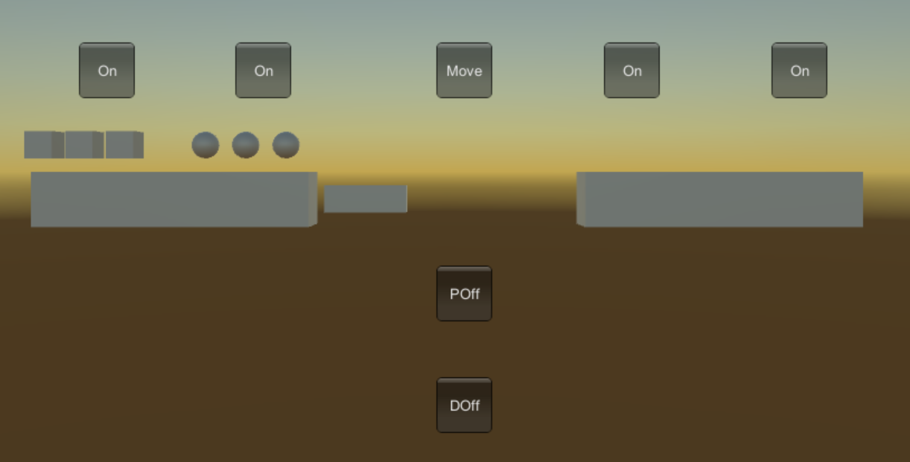

##### 成品图

球体代表牧师，正方体代表魔鬼。




##### 目的

​	使用unity3D做出一个牧师与魔鬼的游戏，程序需要满足以下要求：

* play the game ( http://www.flash-game.net/game/2535/priests-and-devils.html )
* 列出游戏中提及的事物（Objects）
* 用表格列出玩家动作表（规则表），注意，动作越少越好
* 请将游戏中对象做成预制
* 在 GenGameObjects 中创建 长方形、正方形、球 及其色彩代表游戏中的对象。
* 使用 C# 集合类型 有效组织对象
* 整个游戏仅 主摄像机 和 一个 Empty 对象， **其他对象必须代码动态生成！！！** 。 整个游戏不许出现 Find 游戏对象， SendMessage 这类突破程序结构的 通讯耦合 语句。 **违背本条准则，不给分**
* 请使用课件架构图编程，**不接受非 MVC 结构程序**
* 注意细节，例如：船未靠岸，牧师与魔鬼上下船运动中，均不能接受用户事件！


##### MVC简介

​	MVC的全名是Model View Controller，是模型(model)－视图(view)－控制器(controller)的缩写，是一种软件设计典范。它是用一种业务逻辑、数据与界面显示分离的方法来组织代码，将众多的业务逻辑聚集到一个部件里面，在需要改进和个性化定制界面及用户交互的同时，不需要重新编写业务逻辑，达到减少编码的时间。


##### 具体实现

首先在Assets中创建Resources文件夹，在Resources中创建Prefabs文件夹，将做好的对象拖入Prefabs中成为预制。在Assets文件下创建Scripts文件用以放置C#文件。

##### Director

Director类利用了单例模式，第一次调用getInstance()时，因为instance为null，所以instance会保存一个新的Director对象。往后的每次getInstance()，都会获得相同的值。也就是说所有的C#文件都将获得相同的Director对象，从而可以获得一个相同的controller，实现不同类之间的通信。

```C#
//Director.cs
public class Director : System.Object {

    private static Director instance;
    public Controller controller;

    public static Director getInstance()
    {
        if (instance == null)
        {
            instance = new Director();
        }
        return instance;
    }
}
```


###### Controller

Controller类实现了IUserActions接口的方法，并通过一个GenGameObject类型的model变量对游戏对象进行操作。Awake()将Controller注入到单实例中。

```c#
//IUserActions.cs
public interface IUserActions
{
    void priestOn();
    void priestOnEnd();
    void devilOn();
    void devilOnEnd();
    void changeState();
    int Check();
    void priestOff();
    void devilOff();
    void Restart();
}

//Controller.cs
public class Controller : MonoBehaviour, IUserActions
{

    private GenGameObject model;


    private void Awake()
    {
        Director director = Director.getInstance();
        director.controller = this;
    }

    public void setModel(GenGameObject Model)
    {
        model = Model;
    }

    public void priestOn()
    {
        model.priestOn();
    }

    public void devilOn()
    {
        model.devilOn();
    }

    public void changeState()
    {
        model.change_state();
    }

    public void priestOnEnd()
    {
        model.priestOnEnd();
    }

    public void devilOnEnd()
    {
        model.devilOnEnd();
    }

    public int Check()
    {
        return model.Check();
    }

    public void priestOff()
    {
        model.priestOff();
    }

    public void devilOff()
    {
        model.devilOff();
    }

    public void Restart()
    {
        model.Restart();
    }
}
```


###### GenGameObject

GenGameObject类定义了一系列变量。其中priests_start保存左岸牧师的游戏对象，priests_end保存右岸牧师的游戏对象，恶魔同理。onBoat用于存储当前船只上物体的数量。boat_state记录船只的状态，boat_state为1时，船不可移动；值为0时，船在左岸；值为2时，船在右岸。船的移动通过Update()调用boatMove()实现，必须满足两个条件，boat_state不为1和游戏正在进行。通过Check()，可以判断游戏是否结束，当Check()返回1时，游戏胜利并结束；返回2时，游戏失败并结束；返回3时游戏进行中。具体代码如下。

```c#
//GenGameObject.cs部分代码
	private Director instance;
    int onBoat;
    public int speed;
    int boat_state = 1;
    GameObject[] objectOnBoat = new GameObject[2];
    readonly Vector3 shore_begin = new Vector3(10, 0, 0);
    readonly Vector3 shore_end = new Vector3(-10, 0, 0);
    readonly Vector3 boat_begin = new Vector3(-3, 0, 0);
    readonly Vector3 boat_end = new Vector3(3, 0, 0);
    readonly Vector3 priests_begin = new Vector3(-9f, 2, 0);
    readonly Vector3 priests_last = new Vector3(9f, 2, 0);
    readonly Vector3 devils_begin = new Vector3(-15f, 2, 0);
    readonly Vector3 devils_last = new Vector3(15f, 2, 0);
    readonly Vector3 gap = new Vector3(-1.5f, 0, 0);
    Stack<GameObject> priests_start = new Stack<GameObject>();
    Stack<GameObject> devils_start = new Stack<GameObject>();
    Stack<GameObject> priests_end = new Stack<GameObject>();
    Stack<GameObject> devils_end = new Stack<GameObject>();
    GameObject boat;
```


Start()初始化部分变量，并且将GenGameObject注入到单实例中，同时调用Load()实例化所有预制的游戏对象。

```c#
//GenGameObject.cs
	private void Start()
    {
        speed = 10;
        onBoat = 0;
        boat_state = 1;
        instance = Director.getInstance();
        instance.controller.setModel(this);
        Load();
    }

    private void Load()
    {
        Instantiate(Resources.Load("Prefabs/Shore"), shore_begin, Quaternion.identity);
        Instantiate(Resources.Load("Prefabs/Shore"), shore_end, Quaternion.identity);
        boat = Instantiate(Resources.Load("Prefabs/Boat"), boat_begin, Quaternion.identity) as GameObject;
        boat.name = "boat";
        for (int i = 0; i < 3; i++)
        {
            GameObject priest = Instantiate(Resources.Load("Prefabs/Priest"), (priests_begin - gap * i), Quaternion.identity) as GameObject;
            priests_start.Push(priest);
            GameObject devil = Instantiate(Resources.Load("Prefabs/Devil"), (devils_begin - gap * i), Quaternion.identity) as GameObject;
            devils_start.Push(devil);
        }
    }

    public int Check()
    {
        if (devils_end.Count == 3 && priests_end.Count == 3)
        {
            return 1;
        }
        if ((devils_start.Count > priests_start.Count && priests_start.Count != 0))
        {
            if (boat.transform.position == boat_end)
            {
                return 2;
            }
            if (boat.transform.position == boat_begin && onBoat == 0)
            {
                return 2;
            }
        }
        if ((devils_end.Count > priests_end.Count && priests_end.Count != 0))
        {
            if (boat.transform.position == boat_begin)
            {
                return 2;
            }
            if (boat.transform.position == boat_end && onBoat == 0)
            {
                return 2;
            }
        }

        return 3;
    }

	private void Update()
    {
        if (Check() == 3)
        {
            boatMove();
        }
    }
```


priestOn()让左岸的牧师上船，priestOnEnd()让右岸的牧师上船，priestsOff则让牧师下船，恶魔同理。priestsOn()中首先判断priests_start这个栈是否为空，是的话就直接return，不做任何操作。onBoat小于2时，牧师可以上船，同时设置上船牧师的transform.parent为boat.parent,这样改变boat的位置，牧师也会跟着移动。priestOff()通过物体标签tag判断船上物体是否为Priest，从而确定是否让它下船。

```c#
    public void priestOn()
    {
        if (priests_start.Count == 0)
            return;
        if (onBoat < 2)
        {
            GameObject temp = priests_start.Pop();
            temp.transform.parent = boat.transform;
            if (objectOnBoat[0] == null)
            {
                temp.transform.localPosition = new Vector3(0.3f, 1.5f, 0);
                objectOnBoat[0] = temp;
            }
            else
            {
                temp.transform.localPosition = new Vector3(-0.3f, 1.5f, 0);
                objectOnBoat[1] = temp;
            }
            onBoat++;
        }
    }

	public void priestOff()
    {
        for (int i = 0; i < 2; i++)
        {
            if (objectOnBoat[i] != null && objectOnBoat[i].tag == "Priest")
            {
                if (boat.transform.position != boat_begin && boat.transform.position != boat_end)
                    return;
                GameObject pri = objectOnBoat[i];
                pri.transform.parent = null;
                if (boat.transform.position == boat_end)
                {
                    pri.transform.position = priests_last + gap * priests_end.Count;
                    priests_end.Push(pri);
                }
                else if (boat.transform.position == boat_begin)
                {
                    pri.transform.position = priests_begin - gap * priests_start.Count;
                    priests_start.Push(pri);
                }
                objectOnBoat[i] = null;
                onBoat--;
                return;
            }
        }
    }
```


Restart()则通过设置物体对象，让游戏重新开始

```c#
	public void Restart()
    {
        int num = priests_end.Count;
        for (int i = 0; i < num; i++)
        {
            GameObject temp = priests_end.Pop();
            temp.transform.position = priests_begin - gap * priests_start.Count;
            priests_start.Push(temp);
        }
        num = devils_end.Count;
        for (int i = 0; i < num; i++)
        {
            GameObject temp = devils_end.Pop();
            temp.transform.position = devils_begin - gap * devils_start.Count;
            devils_start.Push(temp);
        }
        for (int i = 0; i < onBoat; i++)
        {
            if (objectOnBoat[i] == null)
            {
                i += 1;
            }
            GameObject temp = objectOnBoat[i];
            temp.transform.parent = null;
            if (temp.tag == "Priest")
            {
                temp.transform.position = priests_begin - gap * priests_start.Count;
                priests_start.Push(temp);
            }
            else
            {
                temp.transform.position = devils_begin - gap * devils_start.Count;
                priests_start.Push(temp);
            }
            objectOnBoat[i] = null;
        }
        onBoat = 0;
        boat.transform.position = boat_begin;
        boat_state = 1;
    }
```


###### UserInterface

为界面添加按钮，并调用按钮对应的接口函数

```c#
public class UserInterface : MonoBehaviour
{
    Director instance;
    IUserActions action;

    void Start()
    {
        instance = Director.getInstance();
        action = instance.controller as IUserActions;
    }

    private void OnGUI()
    {
        GUIStyle fontStyle = new GUIStyle();
        fontStyle.fontSize = 40;
        fontStyle.normal.textColor = new Color(255, 255, 255);

        if (action.Check() == 1)
        {
            GUI.Label(new Rect(440, 200, 100, 100), "Win", fontStyle);
            if (GUI.Button(new Rect(435, 360, 80, 50), "Restart"))
            {
                action.Restart();
            }
        }
        if (action.Check() == 2)
        {
            GUI.Label(new Rect(390, 200, 100, 100), "GameOver", fontStyle);
            if (GUI.Button(new Rect(435, 360, 80, 50), "Restart"))
            {
                action.Restart();
            }
        }
        if (GUI.Button(new Rect(130, 300, 50, 50), "On"))
        {
            action.devilOn();
        }
        if (GUI.Button(new Rect(270, 300, 50, 50), "On"))
        {
            action.priestOn();
        }
        if (GUI.Button(new Rect(600, 300, 50, 50), "On"))
        {
            action.priestOnEnd();
        }
        if (GUI.Button(new Rect(750, 300, 50, 50), "On"))
        {
            action.devilOnEnd();
        }
        if (GUI.Button(new Rect(450, 300, 50, 50), "Move"))
        {
            action.changeState();
        }
        if (GUI.Button(new Rect(450, 500, 50, 50), "POff"))
        {
            action.priestOff();
        }
        if (GUI.Button(new Rect(450, 600, 50, 50), "DOff"))
        {
            action.devilOff();
        }
    }
}
```


##### 详细代码

https://github.com/Limsanity/Priest_and_Devils